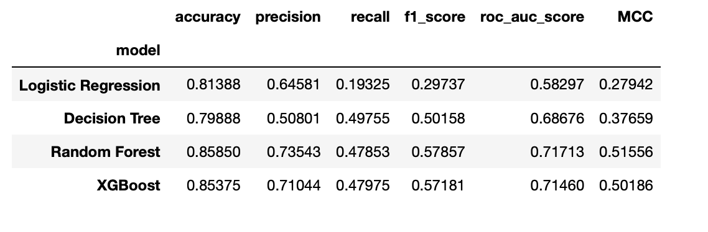

# TopBank Company - A Churn Prediction Project

---

## Table of Contents
- [1. Introduction](#1-introduction)
- [2. The Business Challenge](#2-business-challenge) 
- [3. Project Development](#3-project-development)
- [4. Next Steps](#4-next-steps)
- [5. Lessons Learned](#5-lessons-learned)
- [6. Conclusion](#6-conclusion)
- [7. References](#7-references)

# 1. Introduction
## 1.1 TopBank Company

TopBank is a major banking services company. It operates mainly in European countries offering financial products, from bank accounts to investments, also some types of insurance and investment product.
The company's business model is of the service type, that is, it sells banking services to its customers through physical branches and an online portal.
The company's main product is a bank account, in which the customer can deposit his salary, make withdrawals, deposits and transfer to other accounts. This bank account has no cost to the customer and has a 12-month term, that is, the customer needs to renew the contract for this account to continue using it for the next 12 months.
According to TopBank's Analytics team, each customer who has this bank account returns a monetary value of 15% of their estimated salary, if this is less than the average, and 20% if this salary is greater than the average, during the current period of your account. This amount is calculated annually.

## 1.2 Churn

Generally speaking, Churn is a metric that indicates the number of customers who canceled their contract or stopped buying your product in a given period of time. For example, customers who canceled the service contract or after its expiration, did not renew, are considered churn customers.

Source: [https://sejaumdatascientist.com/predicao-de-churn/](https://sejaumdatascientist.com/predicao-de-churn/)

## 1.3 Project Development Methodology

The project was developed based on the CRISP-DS (Cross-Industry Standard Process - Data Science, a.k.a. CRISP-DM) project management method, with the following steps:

**Step 01. Data Description**

**Step 02. Feature Engineering**

**Step 03. Data Filtering**

**Step 04. Exploratory Data Analysis**

**Step 05. Data Preparation**

**Step 06. Feature Selection**

**Step 07. Machine Learning Modelling**

**Step 08. Hyperparameter Fine Tunning**

**Step 09. Convert Model Performance to Business Values**

**Step 10. Deploy Model to Production**

# 2. Business Challenge

## 2.1 Problem

In recent months, the Analytics team of TopBank realized that the rate of customers cancelling their accounts and leaving the bank, the **churn** rate, reached unprecedented numbers in the company. Concerned about the increase in this rate, the team planned an action plan to reduce the customer evasion rate.

## 2.2 Goal

Create an action plan, with the objective of reducing customer evasion, that is, preventing the customer from canceling their contract and not renew it for another 12 months.

## 2.3 Deliverables

1. Deliver to TopBottom's CEO a model in production, which will receive a customer base via API and will return this same “scored” base, that is, one more column with the probability that each customer will go into churn.
2. Model's performance and results report with the following topics:
    - What's the company's current churn rate?
    - How the churn rate varies per month?
    - What's the model's performance in labelling the clients as churns?
    - What's the company's revenue, if the company avoids the customers to get into churn through the developed model?
3. Possible measure: discount coupon or other financial incentive.
    - Which customers could receive an incentive and at what cost, in order to maximize the ROI (Return on investment)? - The sum of incentives shall not exceed $ 10,000.00.
    
# 3. Project Development

## 3.1 STEP 01 - Data Description

### 3.1.1 Dataset

The Dataset is available on Kaggle: [https://www.kaggle.com/mervetorkan/churndataset](https://www.kaggle.com/mervetorkan/churndataset)

### 3.1.2 Data Dimension

Number of rows: 10,000

Number of columns: 14

Missing values: none

Types of data: float64 (2), int64 (9) and object (3).

### 3.1.3 Features Description

**RowNumber** - The number of the row.

**CustomerID** - Customer's unique identifier.

**Surname** - Customer's surname.

**CreditScore** - Customer's credit score for the consumer market.

**Geography** - The country where the customer lives.

**Gender** - Customer's gender.

**Age** - Customer's age.

**Tenure** - Number of years that the customer was active.

**Balance** - The amount that the customer has in the bank account.

**NumOfProducts** - The number of products bought by the customer.

**HasCrCard** - Flag that indicates if the customer has a credit card.

**IsActiveMember** - Flag that indicates if the customer has done a bank activity in the last 12 months.

**EstimateSalary** - Estimate customer's monthly income.

**Exited** - Flag that indicates if the customer is in Churn.

The dataset was split into train and test sets with a ratio of 80/20. The split was made in the beginning of the project, before any data manipulation / transformation.

### 3.1.4 Descriptive Statistic

### 3.1.4.1 Numerical Attributes

**1. Credit Score**

- Credit score ranges from 350 up to 850. Mean = 652.5288 and Median = 652.

**2. Age**

- Age ranges from 18 up to 92. Mean = 38.9218. Median = 37.

**3. Tenure** 

- Tenure ranges from 0 to 10. Mean = 5.0128. Median = 5. According the histogram, the number of customers with tenure equal to zero and 10 is lower than the other tenure values.

**4. Balance**

- Balance ranges from zero up to 250,898.09**.** Mean = 76,485.88929. Median = 97,198.54000.

**5. Number of Products**

- Number of products ranges from 1 to 4. Mean = 1.5302. Median = 1.

**6. Has Credit Card**

- if the value is 0, the customer has no credit card and if the value is 1, the customer has credit card.
- Mean = 0.7055, that means that 70.55% of the customers have credit card.

**7. Is Active Member**

- if the value is 0, the customer is not active and if the value is 1, the customer is active.
- Mean = 0.5151, that means that 51.51% of the customers are active members and have used a bank service in the past 12 months.

**8. Estimated Salary**

- Estimated salary ranges from 11.58 up to 199,992.48. Mean = 100,090.23988. Median = 100,193.915.

**9. Exited** 

- if the value is 0, the customer is not in churn and if the value is 1, the customer is in churn.
- Mean = 0.2037, that means that **churn rate is 20.37%**

### 3.1.4.2 Categorical Attributes

**9. Surname**

- There are 2,932 different surnames and the most common is 'Smith' with 32 appearances.

**10. Geography**

- More than 50% of the customers come from France, the rest is almost equally divided by Germany and Spain.

**11. Gender**

- 54.57% of the customers are male and 45.43% are female.

## 3.2 STEP 2 - Feature Engineering

### 3.2.1 Mind Map

### 3.2.2 Hypothesis List

#### 3.2.2.1 Draft

Finance

- Costumers with lower salary tend have high churn rate than costumers with higher salaries.
- Costumers with low balance tend have high churn rate than costumers with high balance.

Time

- Newer costumers tend to have higher churn rates than the old ones.

Costumer

- Young costumers have higher churn rate than the old ones.
- Female costumers have higher churn rates than male costumers.
- Churn rate are higher in costumers from France than from Spain and Germany.

Relationship with Bank

- Costumers with no credit card have higher churn rate than the ones that have.
- Costumers that use one product from the bank have higher churn rate.
- Costumers with low credit score have higher churn rate than the ones with high score.
- Costumers that are not active members have higher churn rate.

### 3.2.2.1 Final List

1. Costumers with lower salary tend have high churn rate than costumers with higher salaries.
2. Costumers with low balance tend have higher churn rate than costumers with high balance.
3. Newer costumers tend to have higher churn rates than the old ones.
4. Young costumers have higher churn rate than the old ones. 
5. Female costumers have higher churn rates than male costumers.
6. Churn rate are higher in costumers from France than from Spain and Germany.
7. Costumers with no credit card have higher churn rate than the ones that have.
8. Costumers that use one product from the bank have higher churn rate.
9. Costumers with low credit score have higher churn rate than the ones with high score.
10. Costumers that are not active members have higher churn rate.

### 3.2.3 Feature Engineering

The Feature Engineering was executed based on the features relationship, according to the analysis from the descriptive statistics.

## 3.3 STEP 03 - Data Filtering

No need for data filtering in this project.

## 3.4 STEP 04 - Exploratory Data Analysis

### 3.4.1 Univariate Analysis

Studies the behaviour of the variables independently. (Min, Max, Range, Distribution, etc..)

#### 3.4.1.1 Response Variable

- **Churn (exited = 1) ** 7963
- **No Churn (exited = 0)** 2037

#### 3.4.1.2 Numerical Variable

The histogram below shows the distribution of the numerical features from dataset.

#### 3.4.1.3 Categorical Variable

- **France** 50.140 %
- **Germany** 50.140 %
- **Spain** 24.770 %

- **Male** 54.570 %
- **Female** 45.430 %

### 3.4.2 Bivariate Analysis

Study how the variables impact the response variable. (Correlation, validate hypothesis)

Main hypothesis:

#### 3.4.2.1  - H1. Costumers with lower salary tend have high churn rate than costumers with higher salaries.

Response: **FALSE**.

Even though the density distribution between salaries of costumers that are in churn situation and costumers that are not in churn situation are almost the same, where is confirmed in the correlation heatmap that shows a low coefficient of 0.012; observing the graphs plotted, it is possible to say the there is a modest increase in the churn rate for costumers with higher salaries. 

It becomes clearer this assumption when dividing the costumers by groups in a range of salaries of $5000. The relative percentage of costumers in churn situation is slightly increased, when the range of salaries goes up compared to the distribution of active costumers (no churn).

#### 3.4.2.2  - H2. Costumers with low balance tend have higher churn rate than costumers with high balance.

Response: **FALSE**.

In the distribution plot, the region where the costumer's balance is lower, the density of costumers in no churn situation is higher and as the sum of balance increases the density of costumers in churn is greater than the density of active costumers. In other words, costumers with low balance have low churn rate than the ones with high balance in their bank's account.

This is proved by the relative percentage plot, where is possible to see that the churn rate increases as the balance of the costumer's bank account is high, compared to the churn rate of the costumers that are active. The heatmap shows a correlation coefficient of 0.12 between balance and exited feature.

The percentage of costumers with a balance equal to zero ($0) is expressive. 39.14% for active costumers and 24.54% for costumers in churn.

#### 3.4.2.3  - H3. Newer costumers tend to have higher churn rates than the old ones.

Response: **FALSE**.

The distribution of tenure for costumers in churn and no churn situation has the same pattern. They are evenly distributed, making hard to decide the impact of this feature in the response variable. The heatmap shows a negative correlation coefficient of -0.014. Even though it is difficult to say, it is shown that as the tenure value increases the chance of the costumer be in churn also increases, marking the hypothesis as false.

#### 3.4.2.4  - H4. Young costumers have higher churn rate than the old ones.

Response: **FALSE**.

The costumers in churn tend to have higher age than the ones that are not in churn. In the distribution plot, is shown that the curve of churn costumers is shifted to the right, where the region of costumers with higher age is. The heatmap shows a correlation coefficient of 0.29 between age and exited feature, proving that as the age increases, the chance of the costumer be in churn also increases.

#### 3.4.2.5  - H5. Female costumers have higher churn rates than male costumers.

Response: **TRUE**.

As seen previously in the univariate analysis, the percentage of male and female in the dataset is 54.57% and 45.43 % respectively. However, when the churn situation is plotted among genders the result differs. The percentage of female costumers that are in churn is 55.91 % compared to male costumers, 44.08 %. This result shows that female costumers have higher churn rate than male costumers, proving that the hypothesis is true.

#### 3.4.2.6  - H6. Churn rate are higher in costumers from France than from Germany and Spain.

Response: **FALSE**.

France represents 50.14% of the geography of the bank's geography, it also takes a major slice of the churn costumers alongside Germany. 39.76% of costumers in churn are from France, 39.96% are from Germany and 20.27% Spain. The result shows that for a little difference, Germany still holds the position of the country with higher churn rate compared to Spain and France. This can be even clearer when observing the density distribution plot.

For non churn costumers, France represents 52.79%, Germany takes 21.28% and Spain has 25.91% of their clients.

#### 3.4.2.7  - H7. Costumers with no credit card have higher churn rate than the ones that have.

Response: **TRUE**.

69.90% of costumers that are in churn have credit card and 30.09% do not. However, analysing the data from costumers that are not in churn 70.71% of them also have credit card against 29.28% that do not have. Even with a little difference, costumers with credit card have lower chance to be in churn. This assumption can be proved by plot of the heatmap, which shows a negative correlation coefficient of -0.0071.

#### 3.4.2.8  - H8. Costumers that use one product from the bank have higher churn rate.

Response: **TRUE**.

It is known that all of the costumers used and use at least one product of the bank. The distribution plot shows that as the number of products increases the percentage of costumers in churn. In addition, when comparing the percentage of costumers that are in churn with number of products that they use, 69.17% of costumers in churn used only one product, whereas 17.08% used two products, 10.80% used three products and 2.94% used four products.

For the non-churn costumers, 46.15% use only one product, 53.27% use two products and 0.57% use three products. 

From the heatmap, a coefficient correlation between response variable 'exited' and number of products is -0.0048.

#### 3.4.2.9  - H9. Costumers with low credit score have higher churn rate than the ones with high score.

Response: **TRUE**.

The density distribution plot of credit score for costumers in churn and not in churn have similar behavior. However, the dataset binned of credit score of 50 show clearer the evidence that as the credit scores increases, the percentage of churn costumers also increases. From the relative percentage plot it is possible to see that the percentage of churn clients is higher in the range of 350 to 650, after that the situation inverts as the credit score goes up and the percentage of non churn costumers increases. The coefficient correlation that is found is 0.12 from the heatmap.

 
#### 3.4.2.10  - H10. Costumers that are not active members have higher churn rate.

Response: **TRUE**.

51.51% of the customers are active members, and from the relative percentage distribution plot is possible to see that 55.45% of the active members are not in churn and 36.08% are. On the other hand, 44.54% of the not active members are not in churn and 63.91% are in churn. This proves the hypothesis that costumers are that are not active members have a higher churn rate. The correlation coefficient between the response variable 'exited' and if the member is active or not, is -0.0071. 

### 3.4.3 Multivariate Analysis

Multivariate analysis of numerical attributes made with pearson's correlation method.

highest correlations:

balance x num_of_products = -0.3
age x axited = 0.29

## 3.5 STEP 05 - Data Preparation

### 3.5.1 Boxplot

Boxplots of some features in order to check outliers presence.

### 3.5.1 Rescaling

**3.5.1.2 Standard Scaler**

For features close to a normal distribution → Credit Score

**3.5.1.2 MinMax Scaler**

For features with low outliers influence → Age, Tenure, Balance, Num of Products and Estimated Salary.

### 3.5.2 Transformation

Apply One-Hot Encoding on geography and gender features due to their low cardinality.

## 3.6 STEP 06 - Feature Selection

#### 3.6.1 Split Dataframe into training and test dataset

The first step of feature selection was to remove unnecessary features for the machine learning training: row_number, customer_id and surname.
The dataframe was split in 80% of the data for training and 20% for test keeping the 'Exited' feature proportion in both the test and train dataset.

In the second step, the "exited" feature was detached from the train dataset to become the target variable, in order to allow the model to be trained.

#### 3.6.2 Feature Selector

Random Forest Classifier and Boruta were used to select the top features for the machine learning section. 

*Random Forest Classifier Results*

*Features selected by Boruta*

['age', 'balance', 'num_of_products', 'estimated_salary']

#### 3.6.3 Final List - Features

Based on EDA and Features Selector step, the top features chosen were:

[age', 'balance', 'num_of_products', 'estimated_salary', 'credit_score',
'is_active_member', 'geography_Germany','geography_France','geography_Spain']

## 3.7 STEP 07 - Machine Learning Modelling

### 3.7.1 Balancing Data for Training

Due the fact that the target variable is highly imbalanced, balancing the data is necessary because, training a classification algorithm to detect different classes accurately becomes difficult as the model becomes biased towards prediction. 

A hybrid technique was used, SMOTE + Tomek Links.

The following classifiers were trained in order to solve the churn prediction task.

- Logistic Regression;
- Decision Tree;
- Random Forest;
- XGBoost.

Two trains were performed: first with original imbalanced data, then with balanced data. All the models were evaluated through 10-fold cross-validation on the train dataset. Based on the business context, the recall score play an important part in the model performance analysis. This is because it is better for the business to classify the lowest number of false negatives and the highest number of true positives, which is calculated in the recall score. Additionally, f1-score can be more decisive in this context, because it takes account of recall and precision score. 

The results are displayed below:

### 3.7.2 Models Performance - Imbalanced Data

The logistic regression model has the lowest scores among all models trained, f1-score of 0.29737 and 0.19325 of recall. The Random Forest Classifier has the best precision (0.73543) and F1-score (0.57857).

### 3.7.3 Models Performance - Balanced Data

The XGBoost has the best precision of 0.91779 and a F1-score of 0.88763, whereas the Random Forest Classifier has the best recall (0.91102) and F1-score (0.90064). 

## 3.8 STEP 08 - **Hyperparameter Fine Tunning**

In order to better accomplish the project goals, deliverables and deployment, the chosen model to perform the fine tuning is Random Forest Classifier.

The Fine Tuning was performed using the Random Forest Classifier. Two fine-tuning were performed: the first with balanced data, and the second with imbalanced data.
A Randomized Search was executed through sklearn's RandomizedSearchCV function to perform the fine tuning.
The metrics were calculated using the test set, so that the models can be evaluated on unseen data, therefore a more realistic scenario.
The Random Forest with default hyperparameters, as well as the XGBoost, were also evaluated with their predictions on the test set for comparison purpose. The results are showed below:

The model with best performance, that is, with best F1-Score and best roc_auc_score is XGBoost - balanced.

## 3.9 STEP 09 - **Convert Model Performance to Business Values**

### 3.9.1 Model Performance

#### 3.9.1.1 Precision vs Recall

Increasing the threshold means that the model will improve the ratio of correctly predicted clients in churn, however it will detect less clients that tend to churn. Whereas, decreasing the threshold means that the model will detect more potential churn clients, however the ratio of correctly predicted clients in churn will decrease.

The precision versus recall curve shows that the greater the precision, the lower the recall, and vice-versa.

#### 3.9.1.2 ROC Curve

The Receiver Operating Characteristic Curve (ROC Curve) tells how much the model is capable of distinguishing between classes. The graph below shows that even though the False Positive Rate value or the True Positive Rate value of the model is set differently from the default values, the overall performance of the model remains the same, because the area under the curve remains the same. To improve the overall performance, the model must be fine tuned again or another model must be trained, so that the ROC area under the curve increases (the curve line must get closer to the top left corner).

The trained model can predict if the customers will get into churn or not according to the metrics and performance presented above. However, the model is not capable to determine which customers should receive an incentive in order not to leave the bank. Hence, another two metrics must be applied in order to prioritize and determine the clients that should receive a financial incentive: the Lift Curve and Cumulative Gains Curve.

#### 3.9.1.3 Cumulative Gain Curve

Gain is a measure of the effectiveness of a classification model calculated as the ration between the results obtained with and without the model.

The cumulative gains curve shows that if 20% of customers with highest probability to churn are contacted, using the prediction of the model should reach 60% of total customers in churn. Also, works the reverse way, for exampleif the business goal was, for example, to reach 80% of the customers that are most likely to respond, than 40% of the customers would need to be contacted to achieve that milestone.
As a comparison, using a random client selection (baseline), should reach only 20% of clients in churn. This means that using the model is 60% / 20% = 3 times better than random selection, which is exactly the value showed on the lift curve.

#### 3.9.1.4 Lift Curve

The lift chart provides an easy way to visualize how many times better applying the model is than random selection for any percentage of the ranked records.
The greater the area between the lift curve and the baseline, the better the model.

### 3.9.2 Business Performance

All business results were calculated on the test set.

#### 3.9.2.1. Current Churn Rate

The current churn Rate is 20.37%

#### 3.9.2.2 Churn variation per tenure

It is not possible to calculate how the churn rate varies per month, as there's no month information in the available dataset.
What can be calculated is the churn variation per tenure (number of years that the customer was active).

#### 3.9.2.3 Model's Performance

The model has a precision of 63.59% to label the clients as churns. The model can detect 55.77% of clients in churn.

#### 3.9.2.4 Company's Revenue

- Total current return of all clients: $38,079,850.98
- Total revenue loss if all 407 clients in churn leave the bank: 7,491,850.97.
The total revenue loss represents 19.67% of total current return.
- Company's recovered revenue if 227 clients don't get into churn through the model: 
$4,496,603.52
That represents 55.77% of clients labeled as in churn and 60.02% of the total revenue loss

This is an ideal scenario if the bank uses the model to predict the clientes that would be in churn and all of them would be recovered. 
However, in reality, even if the model predicts that a client would be in churn it does not necessarily mean that this client will not leave the bank. So, to help improve this situation the bank is giving a financial incentive, as stated in the business challenge.  The amount available to give a financial incentive for the clients is constrained to $10,000, that is, is a limited resource that must be applied so that the return on investment (ROI) is maximized.

#### 3.9.2.5 ROI

The Lift Curve and Cumulative Gains Curve showed that if the clients with the highest churn probability according the model's prediction are selected, then the gain over a random selection is maximized.
In this context, four scenarios were simulated:

1. Top 50 clients with highest churn probability, incentive per client: $200.

Recovered Revenue: $897,344.60

% Recovered from Total Revenue loss: 70.23%

Investment: $10,000.00

ROI: 52,613.35%

Potential clients recovered according to model: 49

Potential churn reduction: 12.04%

2. Top 100 clients with highest churn probability, incentive per client: $100.

Recovered Revenue: $1,597,874.34

% Recovered from Total Revenue loss: 70.23%

Investment: $10,000.00

ROI: 52,613.35%

Potential clients recovered according to model: 89

Potential churn reduction: 21.87%

3. Top 200 clients with highest churn probability, incentive per client: $50.

Recovered Revenue: $2,938,193.64

% Recovered from Total Revenue loss: 70.23%

Investment: $10,000.00

ROI: 52,613.35%

Potential clients recovered according to model: 155

Potential churn reduction: 38.08%

4. Top 500 clients with highest churn probability, incentive per client: $20.

Recovered Revenue: 5,261,334.89

% Recovered from Total Revenue loss: 70.23%

Investment: 10,000.00

ROI: 52,613.35%

Potential clients recovered according to modell: 227

Potential churn reduction: 55.77%

Result: **The best alternative is the number 4, predicting a higher ROI.**

# 4. Next Steps

The goal of the next steps is to improve the model performance, hence to improve the business revenue / results.

# 5. Lessons Learned

# 6. Conclusion

# 7. References

